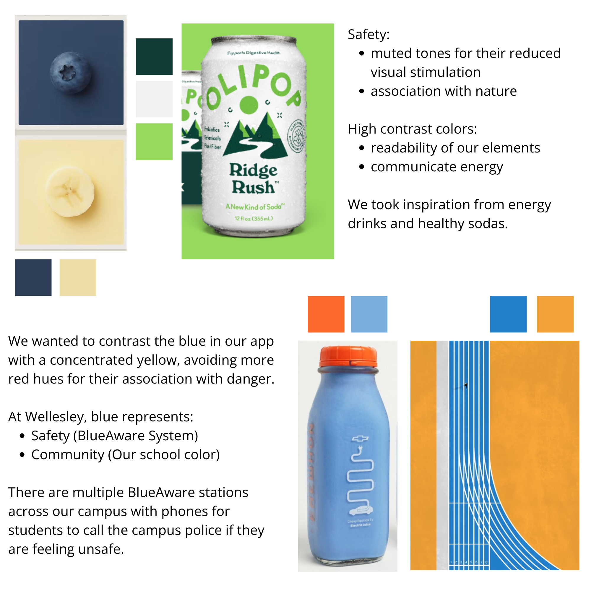
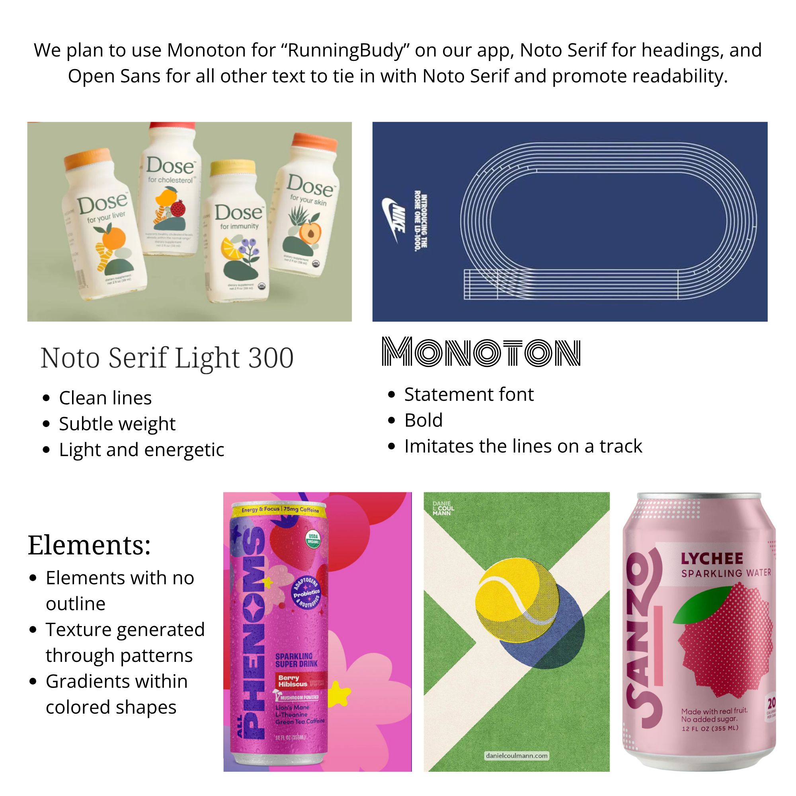

# Functional Design

## Problem Framing (Revised)

## Concept Design
- **PasswordAuthentication**
	- **Purpose:** Associate usernames and passwords with user identities for authentication, limiting access to known users.
	- **Principle:** If a user registers with a unique username and password, they can subsequently authenticate with those credentials and will consistently be treated as the same user.
        - **State:**
            - A set of `Users`, each with:
                - `username`: String
                - `passwordHash`: String (hashed using SHA-256)
        - **Actions:**
            - `register(username: String, password: String): ({ user: User } | { error: String })`
                - *Requires:* No User with the given username already exists.
                - *Effects:* Creates a new User, stores a hash of the password, and returns the new user's ID. On failure, returns an error.
            - `authenticate(username: String, password: String): ({ user: User } | { error: String })`
                - *Requires:* A User with the given username exists AND the hash of the password matches the stored passwordHash.
                - *Effects:* Returns the identifier of the authenticated User. On failure, returns an error.
            - `deleteUser(user: User): ({} | { error: String })`
                - *Requires:* A User with the given user ID exists.
                - *Effects:* Permanently deletes the User and their stored credentials. On failure, returns an error.

- **SharedGoals** [User, User]
    - **Purpose:** Allow two users to collaboratively monitor and achieve a shared running goal by breaking it into actionable steps.
    - **Principle:** After two users agree on a shared goal, they can either have an LLM generate recommended steps or input their own. Both can mark steps as complete, view progress, and see which steps remain.
    - **State:**
        - A set of `SharedGoals`, each with:
            - `userA`: User (one partner)
            - `userB`: User (the other partner)
            - `description`: String (goal description)
            - `isActive`: Boolean (true if the goal is currently being tracked)
        - A set of `SharedSteps`, each with:
            - `sharedGoalId`: SharedGoal (reference to the parent shared goal)
            - `description`: String
            - `start`: Date
            - `completion`: Date? (optional, when the step was completed)
    - **Actions:**
        - `createSharedGoal(userA: User, userB: User, description: String): (sharedGoalId: SharedGoal)`
            - *Requires:* No active `SharedGoal` for this user pair with the same description already exists. `description` is not empty.
            - *Effects:* Creates a new `SharedGoal` with `userA`, `userB`, and `description`; sets `isActive` to `true`; returns `sharedGoalId`. Multiple active shared goals are allowed for the same user pair as long as each has a unique description.
        - `generateSharedSteps(sharedGoal: SharedGoal, user: User): (steps: SharedStep[])`
            - *Requires:* `sharedGoal` exists and is active; no `SharedSteps` are currently associated with this `sharedGoal`.
            - *Effects:* Uses an internal LLM to generate step descriptions based on the shared goal's description; creates new `SharedSteps` for each; returns the array of created steps.
        - `regenerateSharedSteps(sharedGoal: SharedGoal, user: User): (steps: SharedStep[])`
            - *Requires:* `sharedGoal` exists and is active.
            - *Effects:* Deletes all existing `SharedSteps` for the shared goal, then generates new steps as above; returns the array of new steps.
        - `addSharedStep(sharedGoal: SharedGoal, description: String, user: User): (step: SharedStep)`
            - *Requires:* `sharedGoal` exists and is active; `description` is not empty.
            - *Effects:* Creates a new `SharedStep` for the shared goal; returns the new step.
        - `completeSharedStep(step: SharedStep, user: User): Empty`
            - *Requires:* `step` exists and does not have a completion date. The `SharedGoal` is active. Either user may complete a step.
            - *Effects:* Sets the completion date for the step.
        - `removeSharedStep(step: SharedStep, user: User): Empty`
            - *Requires:* `step` exists; no completion date; `SharedGoal` is active. Either user may remove a step.
            - *Effects:* Deletes the step from storage.
        - `closeSharedGoal(sharedGoal: SharedGoal, user: User): Empty`
            - *Requires:* `sharedGoal` exists and is active. Either user may close the goal.
            - *Effects:* Sets `isActive` of the shared goal to `false`.
    - **Queries:**
        - `_getSharedGoals(userA: User, userB: User, isActive?: Boolean): (sharedGoal: {id: SharedGoal, description: String, isActive: Boolean})[]`
            - *Effects:* If isActive is specified, returns only shared goals for the user pair with that active status. If not specified, returns all shared goals (active and inactive) for the user pair.
        - `_getSharedGoalById(userA: User, userB: User, sharedGoalId: SharedGoal): (sharedGoal: {id: SharedGoal, description: String, isActive: Boolean})?`
            - *Effects:* Returns the shared goal with the given id for the user pair, or null if not found.
        - `_getSharedSteps(sharedGoal: SharedGoal): (step: {id: SharedStep, description: String, start: Date, completion: Date?})[]`
            - *Effects:* Returns all steps for the given shared goal.

- **UserProfile** [User]
    - **Purpose:** Allow users to share their personal info, including a real profile image and key tags for access to running partner features.
    - **Principle:** After setting a display name, uploading a profile image from their device, and adding tags (running level, age, gender, etc.), users can be discovered and matched more effectively.
    - **State:**
        - A set of `Users`, each with:
            - `displayname`: String
            - `profileImage`: Image (uploaded from user's device; e.g., file upload or photo)
            - `location`: String
            - `tags`: Object with allowed keys: "gender", "age", "runningLevel", "personality" (e.g., "introvert"/"extrovert"), etc. Each key maps to a single value (String or Number as appropriate).
            - `isActive`: Boolean
    - **Actions:**
        - `createProfile(user: User, location: String): ()`
            - *Requires:* No profile for the given user already exists. `location` must be provided.
            - *Effects:* Creates a new user profile record for the given user with no initial display name, profile image, or tags, and sets the user's location. The profile is not active (not visible) until all required fields are filled out and setActive is called.
        - `setActive(user: User): ()`
            - *Requires:* The user exists in the set of users. All required fields (displayname, profileImage, location, and all required tags) must be filled out.
            - *Effects:* Sets the user's profile to active (visible to others).
        - `setLocation(user: User, location: String): ()`
            - *Requires:* The user exists in the set of users.
            - *Effects:* Updates the user's location.
        - `setName(user: User, displayname: String): ()`
            - *Requires:* The user exists in the set of users.
            - *Effects:* Sets the user's display name.
        - `setProfileImage(user: User, image: Image): ()`
            - *Requires:* The user exists in the set of users.
            - *Effects:* Sets the user's profile image to the uploaded image (from file/photo).
        - `setTag(user: User, tagType: String, value: String|Number): ()`
            - *Requires:* The user exists in the set of users. `tagType` must be one of the allowed types: "gender", "age", "runningLevel", "personality" (e.g., "introvert"/"extrovert"), or other relevant factors as defined by the system. `location` cannot be set or changed with this action.
            - *Effects:* Sets or updates the tag of the specified type for the user's profile. Only one value per tag type is allowed per user.
        - `removeTag(user: User, tagType: String): ()`
            - *Requires:* The user exists in the set of users and the tag type exists for the user.
            - *Effects:* Removes the tag of the specified type from the user's profile.
        - `closeProfile(user: User): ()`
            - *Requires:* The user exists in the set of users.
            - *Effects:* Permanently deletes the user's profile and all associated data.
    - **Queries:**
        - `_getUserProfile(user: User): (userProfile: {displayname: String, profileImage: Image, location: String, tags: {gender?: String, age?: Number, runningLevel?: String, personality?: String, ...}})?`
            - *Effects:* Returns the full profile data for the specified user, including location and all allowed tags.
        - `_findUsersByTag(tagType: String, value: String|Number): (user: User)[]`
            - *Effects:* Returns all users who have the specified tag type and value.
        - `_filterUsers(tags?: { [tagType: string]: String|Number }, location?: String): (user: User)[]`
            - *Effects:* Returns all users who match all specified tag type/value pairs (if any), and/or are in the specified location (if provided). If neither is provided, returns all users.

- **MilestoneMap** [User, User]
    - **Purpose:** Provide a private, shared map using Google Maps API for two running partners to commemorate milestones by dropping pins at specific locations and optionally uploading photos.
    - **Principle:** After becoming running partners, users can mark locations where they achieved milestones together (e.g., first 5K), add descriptions, and upload photos (e.g., a selfie at the milestone spot). Only the two partners can view and edit their shared map.
    - **State:**
        - A set of `MilestoneMaps`, each with:
            - `userA`: User (one partner)
            - `userB`: User (the other partner)
            - `mapUrl`: String (the unique Google My Maps URL or ID for the shared map)
            - `createdAt`: Date
            - `isActive`: Boolean
    - **Actions:**
        - `createMilestoneMap(userA: User, userB: User, mapUrl: String): (milestoneMapId: MilestoneMap)`
            - *Requires:* No existing MilestoneMap for this user pair.
            - *Effects:* Stores a reference to a new shared Google My Map for the two users; returns the map's ID.
        - `deleteMilestoneMap(milestoneMap: MilestoneMap, user: User): ()`
            - *Requires:* `milestoneMap` exists and `user` is one of the partners.
            - *Effects:* Permanently deletes the MilestoneMap reference from the backend. (Does not delete the map from Google My Maps.)
    - **Queries:**
        - `_getMilestoneMap(userA: User, userB: User): (milestoneMap: {id: MilestoneMap, mapUrl: String, createdAt: Date, isActive: Boolean})?`
            - *Effects:* Returns the MilestoneMap reference for the user pair, or null if none exists. All pin and photo data is managed within Google My Maps.

## Syncs

- **After Registration → Create Profile**
    - When a user successfully registers **(PasswordAuthentication)**, an empty **UserProfile** is automatically created for them.

- **Profile Completion → Activation & Discoverability**
    - When a user completely fills out their profile (all required fields), their profile becomes active and they are discoverable by other runners for partner matching and filtering.

- **Post-Run → Option to Continue**
    - After both users complete a run together through the longer-term running partner option, they are prompted with the option to continue running together as partners.

- **Partnership Agreement → SharedGoals & MilestoneMap Setup**
    - If both users agree to continue running together and start their partnership, a **SharedGoals** instance and a **MilestoneMap** are automatically set up for the pair.

- **Partnership End → Reset & Archive**
    - If two users decide to end their partnership, the **PartnerMatching** page is reset for both so they can move on to other matches, and their **SharedGoals** and **MilestoneMap** are erased from active use but remain accessible in an archive/history page for future reference.

# TODO: add notes section to all concepts and syncs 

## User Journey
After moving to a new city for her first year of college, a student feels uncertain about how to find her community on campus and in her city while prioritizing her safety. Reflecting on her past hobbies, she remembers her interest in running, which she had never committed to as she did not want to run alone for safety related reasons. She comes across our website, and upon registering and verifying her student ID, she personalizes her profile by adding a photo of herself, a short bio, and preferences for a running partner. She then decides she wants to go for a run at that moment and heads over to the real-time running partner finder where she finds that others are in the area. She matches with a runner, and has a good time and later decides to look for a longer-term partner. 

After filtering profiles by age, gender, and running level, she connects with someone and they meet up for a run. After running together, they indicate that they want to continue running together. This act unlocks new features that allow them to create shared goals together and have access to a milestone map where they can add photos and captions celebrating their achievements and memorable moments. Their partnership will ensure they remain committed to their goals and feel safer while doing so.

## UI Sketches

## Visual Design Study

### Color

### Typography

# TODO: update the visual design study to final draft

## Design Summary

## Development Plan

We will aim for a timeline similar to the individual projects where we first created our backend, then our frontend, and then introduced syncs. This will ensure we are working incrementally and thoroughly. The table below provides more detailed information for each stage. 

| Stage | Features | Responsibilities | Key Risks |
| :---- | :---- | :---- | :---- |
| November 25th, Checkpoint: Alpha | Password authentication User profile Real-time matching Messaging | Gloria: User profile, Ananya: Marin: | If we find that we are having difficulties with the real-time runner matching, as a fallback, we may decide to combine this feature and the long-term runner matching. This would mean making it so that once a user goes on a run through the real-time matching, the long-term aspect would kick in immediately after they complete their run by asking if they want to be long-term partners.  |
| December 2nd, Checkpoint: Beta | UserVerification Long-term matching Shared goals Milestone map  | Gloria: SharedGoals, Ananya: Marin: | A potential key risk would be incorporating LLM generation of potential steps for the duo to work toward. As a fallback, we will allow users to manually create their own steps for their shared goals. Another key risk would be perfecting the long-term matching but as mentioned in the row above, we will be sure to deeply evaluate what structure of the matching features ends up working best. |
| December 9th, Full Demo | Based on user testing, we will refine our  password authentication, start email verificationfeatures based on the feedback we receive. We will also include our syncs.  | Marin: | A potential key risk would be the feedback we get during user testing. For instance, if users find that an additional feature would be best to include but would be impossible to implement under the time frame, we will evaluate how aspects of the feature could be included within our existing concepts. Additionally, since we now have experience incorporating syncs, we do not expect there to be as many risks here. We plan to keep in contact with our TA Erin to address any potential errors. |