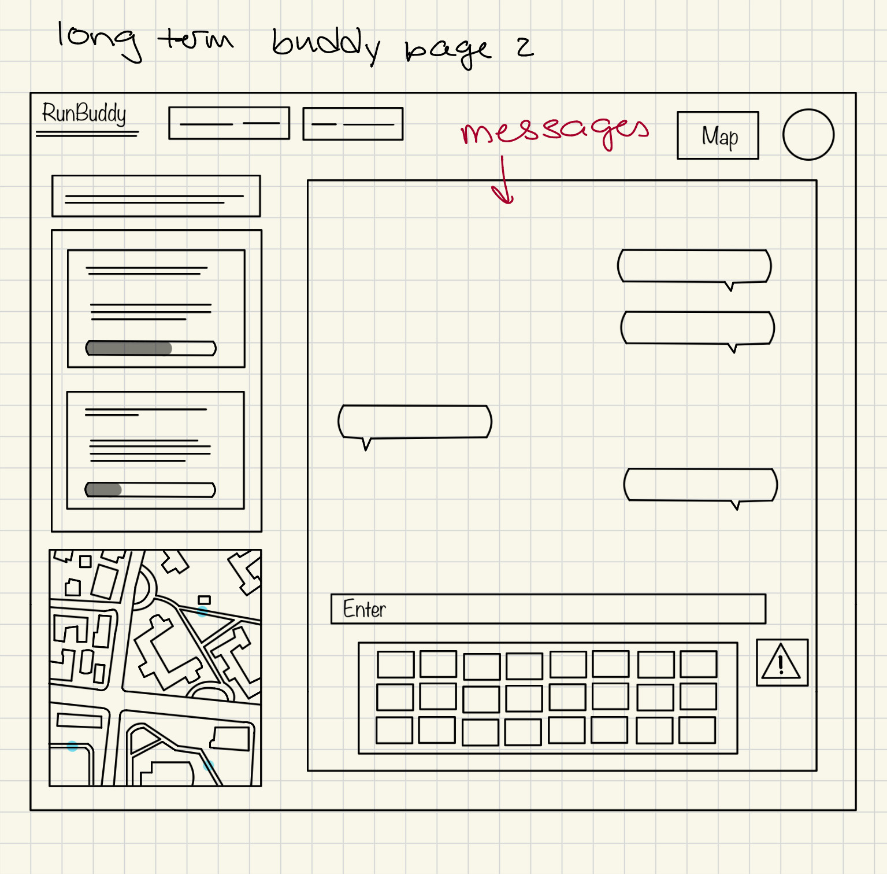
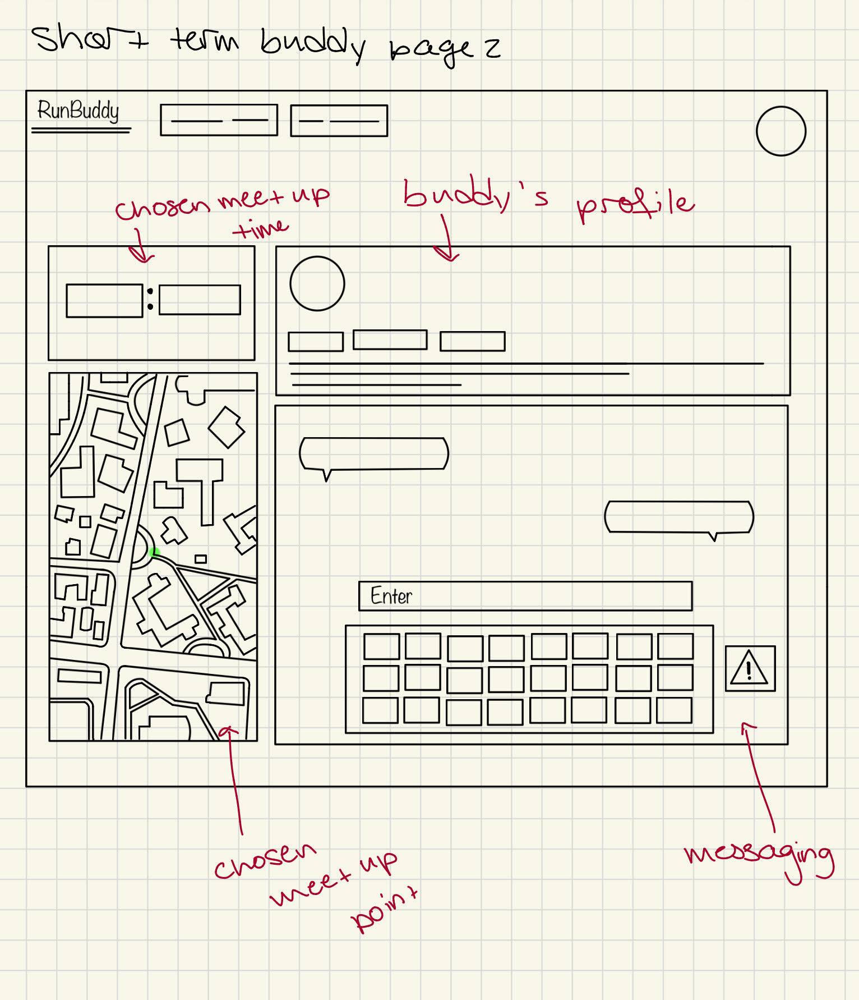

# Functional Design

## Problem Framing (Revised)
We made the huge design change of going from a run club based app to partnerships based on feedback from our initial submission. This was a big shift and we revised our features to reflect what would most make sense with this type of app. Our initial version is [here](https://github.com/mg126e/Project_Backend/blob/8da22449ad7daee908d551b518a69d6533af1b25/problem_framing.md) and Friday's revised version with our updated problem is [here](https://github.com/mg126e/Project_Backend/blob/main/design/problem_framing.md).

## Concept Design
- **EmailVerification**
   - **Purpose:** Ensure that only users with a valid Boston-area college .edu email address can complete registration and access the app.
   - **Principle:** When a user registers, a verification code is sent to their email. The user must enter the correct code to activate their account.
   - **State:**
       - A set of `EmailVerifications`, each with:
           - `user`: User (reference)
           - `email`: String
           - `verificationCode`: String (randomly generated)
           - `isVerified`: Boolean
           - `codeSentAt`: DateTime
   - **Actions:**
       - `register(user: User, email: String): ()`
           - *Requires:* The user exists in PasswordAuthentication. The email domain is a valid Boston-area .edu domain. The user is not already verified.
           - *Effects:* Generates a verification code, sends it to the user's email, and stores the code and timestamp.
       - `verifyCode(user: User, code: String): ({ success: Boolean, error?: String })`
           - *Requires:* A verification code was sent to the user and the code matches the stored code.
           - *Effects:* Sets `isVerified` to true if the code matches
       - `resendCode(user: User): ()`
           - *Requires:* The user is not verified yet.
           - *Effects:* Generates and sends a new code, updates the stored code and timestamp.
   - **Notes:**
       - When `register` is called in PasswordAuthentication, it also triggers `register` in EmailVerification to send the verification email.
       - The user cannot become active or log in until their email is verified.

- **PasswordAuthentication**
   - **Purpose:** Associate usernames and passwords with user identities for authentication, limiting access to known users.
   - **Principle:** If a user registers with a unique username and password, they can subsequently authenticate with those credentials and will consistently be treated as the same user.
       - **State:**
           - A set of `Users`, each with:
               - `username`: String
               - `passwordHash`: String (hashed using SHA-256)
       - **Actions:**
           - `register(username: String, password: String): ({ user: User } | { error: String })`
               - *Requires:* No User with the given username already exists.
               - *Effects:* Creates a new User, stores a hash of the password, and returns the new user's ID. On failure, returns an error.
           - `authenticate(username: String, password: String): ({ user: User } | { error: String })`
               - *Requires:* A User with the given username exists AND the hash of the password matches the stored passwordHash.
               - *Effects:* Returns the identifier of the authenticated User. On failure, returns an error.
           - `deleteUser(user: User): ({} | { error: String })`
               - *Requires:* A User with the given user ID exists.
               - *Effects:* Permanently deletes the User and their stored credentials. On failure, returns an error.
    - **Notes:**
       - deleteUser and closeProfile will work in a sync together

- **UserProfile** [User]
   - **Purpose:** Allow users to share their personal info, including a profile image and key tags for access to running partner features.
   - **Principle:** After setting a display name, uploading a profile image from their device, creating a bio, and adding personal tags (running pace, running level, age, gender, and personality), users can be discovered and matched more effectively.
   - **State:**
       - A set of `Users`, each with:
           - `displayname`: String
           - `profileImage`: Image (uploaded from user's device; e.g., file upload or photo)
           - `bio`: String (a biography where users can state more about themselves and what they are looking for, including describing their personal goals)
           - `location`: String
           - `emergencyContact`: String (phone number)
           - `tags`: Object with allowed keys: "gender", "age", "runningLevel", "runningPace", "personality" (e.g., "introvert"/"extrovert"). Each key maps to a single value.
           - `isActive`: Boolean
   - **Actions:**
       - `createProfile(user: User): ()`
           - *Requires:* No profile for the given user already exists.
           - *Effects:* Creates a new user profile record for the given user with no initial display name, profile image, location, bio, or tags. The profile is not active (not visible to others) until all required fields are filled out.
       - `setActive(user: User): ()`
           - *Requires:* The user exists in the set of users. All required fields (displayname, profileImage, bio, location, and all required tags) must be filled out.
           - *Effects:* Sets the user's profile to active (visible to others).
       - `setLocation(user: User, location: String): ()`
           - *Requires:* The user exists in the set of users.
           - *Effects:* Updates the user's location.
       - `setEmergencyContact(user: User, emergencyContact: String): ()`
           - *Requires:* The user exists in the set of users.
           - *Effects:* Updates the user's emergency contact.
       - `setBio(user: User, bio: String): ()`
           - *Requires:* The user exists in the set of users.
           - *Effects:* Updates the user's biography.
       - `setName(user: User, displayname: String): ()`
           - *Requires:* The user exists in the set of users.
           - *Effects:* Sets the user's display name.
       - `setProfileImage(user: User, image: Image): ()`
           - *Requires:* The user exists in the set of users.
           - *Effects:* Sets the user's profile image to the uploaded image (from file/photo).
       - `setTag(user: User, tagType: String, value: String|Number): ()`
           - *Requires:* The user exists in the set of users. `tagType` must be one of the allowed types: "runningPace", "gender", "age", "runningLevel", "personality" ("introvert"/"extrovert").
           - *Effects:* Sets or updates the tag of the specified type for the user's profile. Only one value per tag type is allowed per user.
       - `removeTag(user: User, tagType: String): ()`
           - *Requires:* The user exists in the set of users and the tag type exists for the user.
           - *Effects:* Removes the tag of the specified type from the user's profile.
       - `closeProfile(user: User): ()`
           - *Requires:* The user exists in the set of users.
           - *Effects:* Permanently deletes the user's profile and all associated data.
    - **Notes:**
        - By requiring that a user must be fully filled in, this helps users feel safer when they are looking for long-term matches
        - We are also going to continue to work on our set of allowed tags as we do testing to see what runners would want to see and filter by the most. Though, users could also discuss the tags within their bio and expand there.
        - Another topic we will navigate is the emergency contact information. A user would provide the phone number of the person. 

- **SharedGoals** [User, User]
   - **Purpose:** Allow two users to collaboratively monitor and achieve a shared running goal by breaking it into actionable steps.
   - **Principle:** After two users agree on a shared goal, they can either have an LLM generate recommended steps or input their own. Both can mark steps as complete, view progress, and see which steps remain.
   - **State:**
       - A set of `SharedGoals`, each with:
           - `userA`: User (one partner)
           - `userB`: User (the other partner)
           - `description`: String (goal description)
           - `isActive`: Boolean (true if the goal is currently being tracked)
       - A set of `SharedSteps`, each with:
           - `sharedGoalId`: SharedGoal (reference to the parent shared goal)
           - `description`: String
           - `start`: Date
           - `completion`: Date? (optional, when the step was completed)
       - `isInitialized`: Boolean (true if the shared goals instance has been set up for this partnership)
   - **Actions:**
       - `createSharedGoal(userA: User, userB: User, description: String): (sharedGoalId: SharedGoal)`
           - *Requires:* No active `SharedGoal` for this user pair with the same description already exists. `description` is not empty.
           - *Effects:* Creates a new `SharedGoal` with `userA`, `userB`, and `description`; sets `isActive` to `true`; returns `sharedGoalId`. Multiple active shared goals are allowed for the same user pair as long as each has a unique description.
       - `generateSharedSteps(sharedGoal: SharedGoal, user: User): (steps: SharedStep[])`
           - *Requires:* `sharedGoal` exists and is active; no `SharedSteps` are currently associated with this `sharedGoal`.
           - *Effects:* Uses an internal LLM to generate step descriptions based on the shared goal's description; creates new `SharedSteps` for each; returns the array of created steps.
       - `regenerateSharedSteps(sharedGoal: SharedGoal, user: User): (steps: SharedStep[])`
           - *Requires:* `sharedGoal` exists and is active.
           - *Effects:* Deletes all existing `SharedSteps` for the shared goal, then generates new steps as above; returns the array of new steps.
       - `addSharedStep(sharedGoal: SharedGoal, description: String, user: User): (step: SharedStep)`
           - *Requires:* `sharedGoal` exists and is active; `description` is not empty.
           - *Effects:* Creates a new `SharedStep` for the shared goal; returns the new step.
       - `completeSharedStep(step: SharedStep, user: User): Empty`
           - *Requires:* `step` exists and does not have a completion date. The `SharedGoal` is active. Either user may complete a step.
           - *Effects:* Sets the completion date for the step.
       - `removeSharedStep(step: SharedStep, user: User): Empty`
           - *Requires:* `step` exists; no completion date; `SharedGoal` is active. Either user may remove a step.
           - *Effects:* Deletes the step from storage.
       - `closeSharedGoal(sharedGoal: SharedGoal, user: User): Empty`
           - *Requires:* `sharedGoal` exists and is active. Either user may close the goal.
           - *Effects:* Sets `isActive` of the shared goal to `false`.
       - `setInitialized(sharedGoals: SharedGoals, isInitialized: Boolean): Empty`
           - *Effects:* Sets the `isInitialized` flag of the shared goal instance (for both partners) to the provided value (`true` or `false`).
   - **Notes:**
       - Assuming that for the actions other than setInitialized, the SharedGoals instance being initialized would also be required. Initialized essentially just means if the shared goals feature is now active for the partners
       - We are going to allow LLM generation and manual creation of steps

- **MilestoneMap** [User, User]
   - **Purpose:** Provide a private, shared map using Google Maps API for two running partners to commemorate milestones by dropping pins at specific locations with captions and optionally uploading photos.
   - **Principle:** After becoming running partners, users can mark locations where they achieved milestones together (for example, their first 5K), add descriptions, and upload photos (for example, a selfie at the milestone spot). Only the two partners can view and edit their shared map.
   - **State:**
       - A set of `MilestoneMaps`, each with:
           - `userA`: User (one partner)
           - `userB`: User (the other partner)
           - `mapUrl`: String (the unique Google My Maps URL or ID for the shared map)
           - `createdAt`: Date
           - `isActive`: Boolean
   - **Actions:**
       - `createMilestoneMap(userA: User, userB: User): (milestoneMap: MilestoneMap)`
           - *Requires:* No existing MilestoneMap for this user pair.
           - *Effects:* Stores a reference to a new shared Google My Map for the two users; returns the map's ID.
       - `closeMilestoneMap(milestoneMap: MilestoneMap): ()`
           - *Requires:* `milestoneMap` exists.
           - *Effects:* Closes the MilestoneMap reference for the two users.
   - **Notes:**
       - The actual milestone data (pins, photos, descriptions) is managed within Google My Maps, and this concept primarily stores the reference to the shared map and handles its lifecycle for the duo.
       - closeMileStoneMap would still preserve the map for the user's archive  
        - An issue to resolve with this would be perfecting the manner we will go about a full history reset, including with shared goals if the two users end their partnership and either does not want a saved history

* RunningBuddies **
no 
**concept** RunBuddyFinder  
**purpose** find a running partner for a one-time run in the near or immediate future  
**principle** a user chooses a region and a specific meeting location in it;  
   the user creates a run invite, which becomes visible to all users whose region is set to the same;  
   other users may accept or decline the invite;  
   once a user accepts, a run is scheduled for the inviter and accepter.

**state**  
	a set of Users with  
	   a Region  
	   a set of run Invites  
	   a set of scheduled Runs

   a set of run Invites with  
	   a Sent flag  
      
   a start Time  
	   an Inviter user  
	   a running Distance  
	   a meeting Location  
	   an acceptance Status flag

	a set of scheduled Runs with  
  a start Time  
  an Inviter user  
  an Accepter user  
  a Completed flag  
	  a meeting Location  
	        
**actions** 

setRegion (user: User, region: Region)  
   **requires** user exists and Region is a valid region  
   **effects** sets the user’s region to the given Region

createInvite (inviter: Inviter, region: Region, start: Time, distance: Number, location: Location): (invite: Invite)  
   **requires** inviter exists, location is in inviter’s Region, start is a future time, and distance is greater than zero  
   **effects** creates a new run Invite with given details and Sent flag set to false

sendInvite (invite: Invite)  
   **requires** the invite exists and its Sent flag is set to False  
   **effects** sends Invite to all users in its associated region and sets Sent flag to True

deleteInvite (user: Inviter, invite: Invite)  
   **requires** the invite exists and  the user is the Inviter for that invite  
   **effects** remove Invite from the Inviter’s set of invites and set its Sent flag to false if true

acceptInvite (inviter: Inviter, invite: Invite, accepter: Accepter): (scheduledRun: Run)  
   **requires** the invite exists, its Sent flag is true, and its acceptance status is false  
   **effects** the acceptance Status of the invite is set to true and the Inviter is notified of the acceptance

declineInvite (invite: Invite, decliner: User)  
   **requires** the invite exists, its Sent flag is true, and its acceptance Status is set to false

**system** scheduleRun (inviter: Inviter, accepter: Accepter, invite: Invite): (run: Run)  
   **requires** the invite exists and its acceptance status is true  
   **effects** creates a run with the details in the invite such as time and location

completeRun (inviter: Inviter, accepter: Accepter, run: Run)  
   **requires** the run exists for both users and has not already been marked Completed  
   **effects** sets the Completed flag of the run to true

cancelRun (inviter: Inviter, accepter: Accepter, run: Run, time: Time)  
   **requires** the run exists for both users and is at a valid future time  
   **effects** deletes the run from both users’ set of runs 

* PartnerMatching **

**concept** PartnerMatching  
**purpose** match users with a long-term running partner based on running preferences and experience levels  
**principle** a user creates a profile with their personal details and preferences;  
  they are then presented with other users whose profiles indicate that they may align with theirs;  
   a user can accept or decline a match and a match only turns active when both users accept the other;  
   users can have multiple long-term running partner matches at the same time  
     
**state**  
a set of Users with  
   a Profile  
   a set of active Matches  
   a set of match Suggestions

a Profile with  
  a set of running Preferences

a set of running Preferences with  
	   a Pace selection   
	   a distance Number  
	   an experience Level  
	   a preferred Time of day

a set of match Suggestions with  
   a Recipient user  
   a Candidate user  
   an acceptance Status flag

**actions**

updatePreferences (user: User, preferenceSet: Preferences)  
   **requires** the user exists and has a profile  
   **effects** replaces the running preferences in the user’s profile with given ones

**system** suggestMatch (recipient: Recipient, candidate: Candidate): (match: Suggestion)  
   **requires** the recipient and candidate exist and are distinct; both have profiles;  
	    there is no active match and no existing suggestions with any combination of  the users;  
	    at least three preferences must be the same for both users  
   **effects** creates and returns a new match Suggestion with the candidate to the recipient

acceptSuggestion (match: Suggestion, recipient: Recipient, candidate: Candidate): (match: Suggestion)  
   **requires** a Suggestion exists with recipient user being Recipient and candidate user being Candidate  
   **effects** the Status flag of the Suggestion is set to true and returns Suggestion as a potential match

declineSuggestion (match: Suggestion, recipient: Recipient, candidate: Candidate)  
   **requires** a Suggestion exists with recipient user being Recipient and candidate user being Candidate

match (suggestionPair: Suggestions, user: UserA, user: UserB): (activeMatch: Match)  
   **requires** the Suggestion of UserA to UserB needs to be accepted by UserB and vice versa  
   **effects** creates and returns a new active Match between the two users 

unmatch (activeMatch: Match, user: UserA, user: UserB)  
   **requires** there exists an active Match between UserA and UserB  
   **effects** deletes the Match from UserA and UserB’s set of Matches

**Notes:** 

- suggestMatch is a **system** action as users have no direct control or interaction with this, since matches are automatically generated based on preference settings  
- The recipient user is the one who receives the suggestion and the candidate user is the one who is being suggested.  
- Any notion of a createPreferences action is subsumed by the updatePreferences since technically, users can also have no preferences set (presumably when they first create their account).

* Messaging  **

**concept** Messaging  
**purpose** one user can send a private message to another user to communicate about scheduled runs  
**principle** a user may send a private message to another user only if there is an active connection between them,  
   this could be either an active match with a long-term partner or an accepted one-time run invite;  
   messages are organised by the context of the connection (partner or one-time run);  
   users can view a history of messages for each connection;  
   each connection maintains its own separate conversation thread;  
   messages cannot be sent to users with whom there is no active connection

**state**  
a set of Users with  
   a set of Chats

a set of Chats with  
   a Recipient user  
   a set of Messages  
  a connection context Tag  \\\\ either a one-time or long-term running partner

a set of Messages with	  
   a Sender user  
   a Timestamp  
   a content String  
   a delivered or read Status

**actions**

startChat (userA: User, userB: User, context: Tag): (chatA: Chat, chatB: Chat)  
   **requires** userA and userB exist and are distinct; there is a valid context Tag connecting userA and userB;  
     there is no existing chat in this context between userA and userB  
   **effects** creates and returns a new Chat between userA and userB for each user, chatA and chatB

deleteChat (initiator: User, userB: User, chat: Chat)  
   **requires** there is an existing chat between the initiator of the deletion and userB  
   **effects** deletes the chat between the initiator and userB only for the initiator

**system** deleteChat (userA: User, userB: User, chat: Chat)  
   **requires** there is an existing chat between userA and userB  
   **effects** deletes the chat between userA and userB for both users

createMessage (sender: User, recipient: User, chat: Chat, content: String): (message: Message)  
   **requires** the sender and recipient must have an existing chat; the content must not be empty  
   **effects** creates and returns a new message in the chat between the sender and recipient with the content

sendMessage (message: Message, time: Timestamp, chat: Chat, sender: User, recipient: User)  
   **requires** there is an existing chat between the sender and recipient; the message must exist   
   **effects** sends the message from the recipient to the sender with a Timestamp, with Status set to delivered

readMessage (message: Message, chat: Chat, sender: User, recipient: User, time: Timestamp)  
   **requires** recipient has an existing chat with sender; message exists and its Status is set to ‘delivered’  
   **effects** marks the Status of the message to ‘read’

**Notes:** 

- There are two versions of the deleteChat action. One is an action available to a user as in any messaging platform where they can delete a chat they have with another user without affecting the other user’s access to it. The **system** action is so that we, as developers, can delete a chat for both parties in cases where they should not be able to contact each other after a certain point (e.g. one-time running partners shouldn’t be able to message each other after the run is marked as complete, to prevent avenues for harassment and unsolicited messaging).

## Syncs

> sync emailVerificationOnRegister
>> when PasswordAuthentication.register(username, password, email): (user)\
>> then EmailVerification.register(user, email)

- **Notes: After Registration → Send Verification Email**:
   - In **PasswordAuthentication**, `register` adds/logs the user and password.
   - In **EmailVerification**, `register` is triggered, after the user makes that attempt to register, to send a verification email to the user.

> sync createProfileOnRegister
>> when PasswordAuthentication.register(username, password, email): (user) and EmailVerification._isEmailVerified(user): true\
>> then UserProfile.createProfile(user)

- **Notes: After Completed Registration → Create Profile**
   - When a user successfully registers, an empty **UserProfile** is automatically created for them.

> sync createGoalsAndMapOnPartnership
>> when Partnership.agree(userA, userB)\
>> then SharedGoals.setInitialized(sharedGoals, true) and MilestoneMap.createMilestoneMap(userA, userB)

- **Notes: Partnership Agreement → SharedGoals & MilestoneMap Setup**
   - If both users agree to continue running together and start their partnership, a **SharedGoals** instance and a **MilestoneMap** are automatically set up for the pair.

> sync archiveOnPartnershipEnd
>> when Partnership.end(userA, userB)\
>> then SharedGoals.setInitialized(sharedGoals, false) and MilestoneMap.closeMilestoneMap(milestoneMap)

- **Notes: Partnership End → Delete SharedGoals & MilestoneMap**
   - If two users decide to end their partnership, the **PartnerMatching** page is reset for both so they can move on to other matches, and their **SharedGoals** and **MilestoneMap** are erased from active use but remain accessible in an archive/history page for future reference.

> sync deleteUserOnCloseProfile
>> when UserProfile.closeProfile(user)\
>> then PasswordAuthentication.deleteUser(user)

- **Notes: Close Profile → Delete User**
   - Ensures that when a user closes their profile, their authentication credentials are also deleted, which prevents them from trying to log in again and then seeing an empty profile and running into the errors that that act would lead to.

**sync** match  
**when** PartnerMatching.acceptSuggestion (MatchAB, RecipientA, CandidateB): (match: SuggestionA)  
             PartnerMatching.acceptSuggestion (MatchBA, RecipientB, CandidateA): (match: SuggestionB)  
**then** PartnerMatching.match ({SuggestionA, SuggestionB}, UserA, UserB): (activeMatch: Match)

**sync** chat  
**when** PartnerMatching.match  ({SuggestionA, SuggestionB}, UserA, UserB): (activeMatch: Match)  
**then** Messaging.startChat (UserA,  UserB, context: PartnerMatching): (chat: Chat)

**sync** schedule  
**when** RunBuddyFinder.acceptInvite (inviter: UserA, invite: Invite, accepter: UserB)  
**then** RunBuddyFinder.scheduleRun (inviter: UserA, invite: Invite, accepter: UserB): (run: Run)

**sync** deleteChat  
**when** RunBuddyFinder.completeRun (inviter: Inviter, accepter: Accepter, run: Run)  
**then system** Messaging.deleteChat (userA: Inviter, userB: Accepter, chat: Chat)

**sync** suggest  
**when** RunBuddyFinder.completeRun(inviter: Inviter, accepter: Accepter, run: Run)  
**then** PartnerMatching.suggestMatch (recipient: Inviter, candidate: Accepter)  
           PartnerMatching.suggestMatch (recipient: Accepter, candidate: Inviter)

**sync** oneTimeChat  
**when** RunBuddyFinder.scheduleRun (inviter: UserA, invite: Invite, accepter: UserB): (run: Run)  
**then** Messaging.startChat (UserA,  UserB, context: RunBuddyFinder): (chat: Chat)

**sync** cancelRun  
**when** RunBuddyFinder.cancelRun (inviter: Inviter, accepter: Accepter, run: Run, time: Time)  
**then system** Messaging.deleteChat(userA: Inviter, userB: Accepter, chat: Chat)

## User Journey
After moving to a new city for her first year of college, a student feels uncertain about how to find her community on campus and in her city while prioritizing her safety. Reflecting on her past hobbies, she remembers her interest in running, which she had never committed to as she did not want to run alone for safety related reasons. She comes across our website, and upon registering and verifying her student ID, she personalizes her profile by adding a photo of herself, a short bio, and preferences for a running partner. She then decides she wants to go for a run at that moment and heads over to the one-time running partner finder where she finds that others are in the area. She matches with a runner, and has a good time and later decides to look for a longer-term partner. 

After filtering profiles by age, gender, and running level, she connects with someone and they meet up for a run. After running together, they indicate that they want to continue running together. This act unlocks new features that allow them to create shared goals together and have access to a milestone map where they can add photos and captions celebrating their achievements and memorable moments. Their partnership will ensure they remain committed to their goals and feel safer while doing so.

## UI Sketches

## Visual Design Study

### Color

### Typography

## Design Summary

The app addresses two central problems: runners’ personal safety and the difficulty of finding compatible running partners. To solve this, the design combines two core matching concepts. RunBuddyFinder provides short-term, one-off partner matches based on current availability, while PartnerMatching focuses on long-term pairings aligned with pace, experience, distance preferences, and running goals. Together, these concepts support users who need immediate companionship as well as those seeking ongoing running relationships.

A customizable user profile is central to both systems. Because runners’ motivations change over time, such as shifting from casual 5Ks to marathon training, it is important to have a profile where users can share about themselves, including about their pace ranges, experience levels, and goals. This ensures that matches remain relevant throughout their running journey, directly addressing concerns about adaptability and long-term usefulness.
 
To support relationship building, features like Shared Goals and the MilestoneMap help partners stay motivated through collaborative goals and shared memories. This reinforces the insight that running partnerships can naturally evolve into valued long-term friendships and recurring routines. These ongoing partnerships also benefit indirect stakeholders such as local businesses, since users may meet before or after runs at nearby cafés, gyms, or gear shops. Short-term matches will also use an in-app map showing surrounding businesses and paths, giving runners convenient meetup options that integrate them more positively into the local community.
 
Safety is a central concern, particularly the risks of stalking, fake profiles, or the inappropriate usage of partner-finding platforms. To mitigate this, the app restricts access to verified university students only, requiring a valid student email address during registration. This creates a smaller, more trustworthy population and reduces the likelihood of malicious actors entering the system. Users also do not have to give out personal information such as their phone number or social media handle as all coordination can be handled within the app through direct messaging. For additional protection, users can report and unmatch partners who behave inappropriately, and an optional post-run check-in notifies an emergency contact if a user does not confirm they finished their run safely.
 
However the remaining issue is how to maintain strong privacy protections as the app evolves as there will be direct messaging and user location information. The current protections are secure authentication and email verification.

## Development Plan

We will aim for a timeline similar to the individual projects where we first created our backend, then our frontend, and then introduced syncs. This will ensure we are working incrementally and thoroughly. The table below provides more detailed information for each stage.  

| Stage | Features | Responsibilities | Key Risks |
| :---- | :---- | :---- | :---- |
| November 25th, Checkpoint: Alpha | Password authentication   User profile   One-time matching   Messaging | Gloria: User profile, password authentication    Ananya: One-time matching  Marin: Messaging  ALL: collaborate to connect our concepts to our frontend | If we find that we are having difficulties with the real-time runner matching, as a fallback, we may decide to combine the one-time matching feature with the long-term matching. This would mean making it so that once a user goes on a run through the one-time matching, the long-term aspect would kick in immediately after they complete their run by asking if they want to be long-term partners. |
| December 2nd, Checkpoint: Beta | EmailVerification   Long-term matching   Shared goals   Milestone map  | Gloria: SharedGoals  Ananya: Long-term matching, email verification  Marin: Milestone map ALL: collaborate to connect our concepts to our frontend | A potential key risk would be incorporating LLM generation of potential steps for the running partners to work towards their goals as the steps may be irrelevant to how the users envisioned reaching their goals. We will mitigate this risk by working on perfecting our prompt and testing out step generation. As a fallback, we will allow users to manually create their own steps for their shared goals. Another key risk would be perfecting the long-term matching but as mentioned in the row above, we will be sure to deeply evaluate what structure of the matching features ends up working best and look into how preference thresholds are designed to match two people. |
| December 9th, Full Demo | Based on user testing, we will refine our features based on the feedback we receive. We will also include our syncs. We will also deploy using Render. | ALL: work on syncs & complete extensive testing on our backend and frontend | A potential risk could be from the feedback we get during user testing. For instance, if users find that an additional feature would be best to include but would be impossible to implement under the time frame, we will evaluate how aspects of the feature could be included within our existing concepts. Additionally, since we now have experience incorporating syncs, we do not expect there to be as many issues here but we plan to ask questions on Piazza or to our TA mentor if huge issues arise that we would need another perspective on. |
